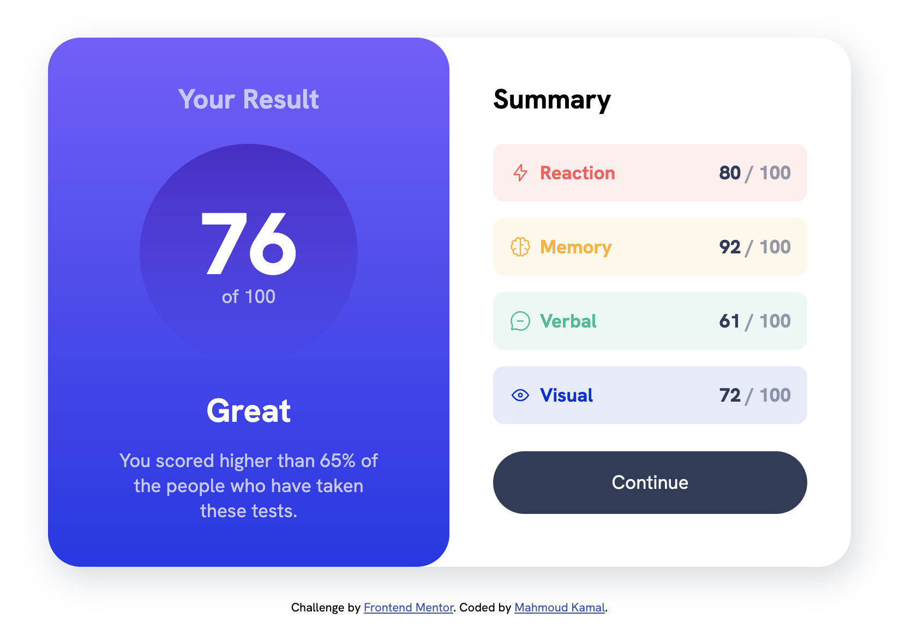
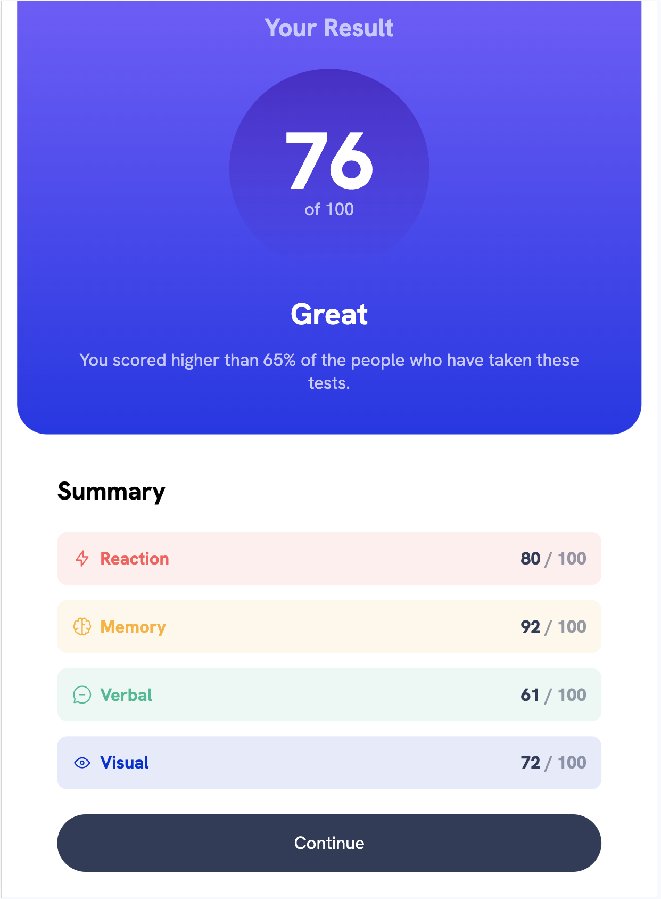

# Frontend Mentor - Results summary component solution

This is a solution to the [Results summary component challenge on Frontend Mentor](https://www.frontendmentor.io/challenges/results-summary-component-CE_K6s0maV).

## Table of contents

- [Overview](#overview)
  - [The challenge](#the-challenge)
  - [Screenshot](#screenshot)
  - [Links](#links)
- [My process](#my-process)
  - [Built with](#built-with)
  - [What I learned](#what-i-learned)
  - [Continued development](#continued-development)
  - [Useful resources](#useful-resources)
- [Author](#author)
- [Acknowledgments](#acknowledgments)

**Note: Delete this note and update the table of contents based on what sections you keep.**

## Overview

### The challenge

Users should be able to:

- View the optimal layout for the interface depending on their device's screen size
- See hover and focus states for all interactive elements on the page
- **Bonus**: Use the local JSON data to dynamically populate the content

### Screenshot

### Links

- Solution URL: [My solution github repo](https://github.com/Twixii99/Frontend-Mentor--Results-summary-component)
- Live Site URL: [live website](https://twixii99.github.io/Frontend-Mentor--Results-summary-component/)

## My process

### Built with

- Semantic HTML5 markup
- CSS custom properties
- Flexbox
- CSS Grid
- Live server

### Continued development

- Learning JS to add more dynamicity to the website, for example adding the summary items dynamically from the JSON file.
- Learning how to think on paper about the relations between the components of the design and then start coding.
  - think about when to use grid and flex.
  - when to use class selctor or attribue selector.
  - thinking about custom properties (css variables).
  - adding the starter code for my project before doing anything.

- [Kevin Powell](https://www.youtube.com/watch?v=KqFAs5d3Yl8) - This helped me for redesigning my code to be cleaner and more elegant than it was, it also helped me to think before code the project. I finished the project before showing it but it had many repeated code with lots of bugs.

- [Elzero web school](https://www.youtube.com/@ElzeroWebSchool) - Where i learned HTML and CSS.

## Author

- Website - [Mahmoud Kamal](https://github.com/Twixii99)
- Frontend Mentor - [Twixii99](https://www.frontendmentor.io/profile/Twixii99)
- linkedin - [Mahmoud Kamal](https://www.linkedin.com/in/mahmoud-kamal-120176169/)
